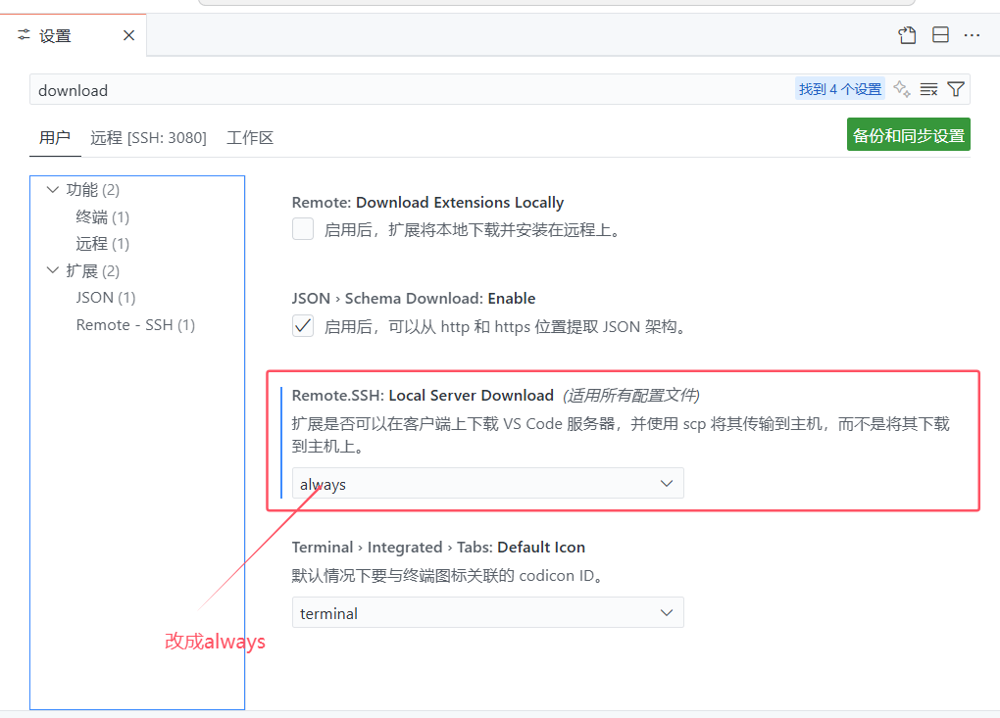

# 使用新版本VSCode Remote-SSH 连接旧版本Ubuntu电脑


github copilot在今天 (2025.08.07) 早上更新之后似乎不再支持旧的vscode版本，更新vscode版本即可使用

但对于使用 remote-ssh 远程开发的用户而言，高版本的vscode会无法连接到低版本（glibc <=2.28）的服务器，而升级glibc非常困难，稍有不慎就要重装系统。

经过了一天的折腾，走了很多弯路，查阅了很多资料，我在这里提出一个我自己的解决方案（不是最好的，但在我的设备上work了）


方法的核心就是使用patchelf链接到一个更高版本的glibc


## 1.官网给出的解决方法


[Can I run VS Code Server on older Linux distributions?](https://code.visualstudio.com/docs/remote/faq#_can-i-run-vs-code-server-on-older-linux-distributions)

我卡在了 ct-ng build 那步，不知道为什么在我的电脑上无法运行。建议优先尝试官方的解决方案。


## 2.互联网上搜到的资料


我主要看了这四个方法：

1. [CSDN:使用patchelf解决vscode远程连接不支持低版本glibc的问题](https://blog.csdn.net/qq_42650988/article/details/137089943)
2. [最新版VSCode通过SSH远程连接Ubuntu16.04等旧版Linux的方法](https://www.ewbang.com/community/article/details/1000235926.html)
3. [知乎回答：关于vs code无法远程连接至centos7服务器的解决方案](https://zhuanlan.zhihu.com/p/1909663308669260068)
4. [个人博客：VSCode 远程开发连接低版本 Linux 系统](https://d1.fan/2025/07/27/VSCode/)


## 3.我的方法


### 3.1 下载并在本地编译glibc


方法 2, 3, 4 都使用 crosstool 来编译工具链（glibc），但是我在实际运行的时候会出现一些问题

所以我采用了方法 1 中的下载方法，使用github仓库 [glibc-all-in-one](https://github.com/matrix1001/glibc-all-in-one) 下载

首先 `cd` 到 `glibc-all-in-one` 目录下

我下载的是 `libc6_2.35-0ubuntu3_amd64.deb2.31-0ubuntu9.14_amd64` 版本，浏览器下载之后移动到 `/your/path/to/glibc-all-in-one/libs`目录下

然后执行 `sudo ./build 2.35 amd64`（根据下载的版本更改，我下载的2.35，原贴中是2.31）这一步会在**根目录**下编译生成 `/glibc` 文件夹，可以将其移动到 `glibc-all-in-one` 文件夹中，也可以不移动，这个路径在之后会用到。


### 3.2 安装patchelf

在这一步我参照了方法 2，安装了 0.16版本的 patchelf，下载链接：[patchelf](https://github.com/NixOS/patchelf)

下载后解压到 `/usr/local/bin/patchelf `目录下即可

解压完成后可以编译一个 hello_world.c 来验证一下有没有安装成功：

```c
#include <stdio.h>

int main() {
    printf("Hello, World!\n");
    return 0;
}
```


 下面是我的测试输出，证明安装成功，链接是有效的

`/glibc/2.35/amd64/lib/ld-linux-x86-64.so.2` 和 `/glibc/2.35/amd64/lib` 替换成自己的目录

```bash
(base) ubuntu@ubuntu:/home/HDD2/gty$ gcc test.c
(base) ubuntu@ubuntu:/home/HDD2/gty$ ./a.out
Hello, World!
(base) ubuntu@ubuntu:/home/HDD2/gty$ patchelf --set-interpreter /glibc/2.35/amd64/lib/ld-linux-x86-64.so.2 --set-rpath /glibc/2.35/amd64/lib a.out
(base) ubuntu@ubuntu:/home/HDD2/gty$ ./a.out
Hello, World!
(base) ubuntu@ubuntu:/home/HDD2/gty$ ldd a.out
    linux-vdso.so.1 (0x00007ffc4b6fe000)
    libc.so.6 => /glibc/2.35/amd64/lib/libc.so.6 (0x00007f3c38292000)
    /glibc/2.35/amd64/lib/ld-linux-x86-64.so.2 => /lib64/ld-linux-x86-64.so.2 (0x00007f3c3888f000)
```


### 3.3 搞出来 /home/用户名/.vscode-server/bin/ 目录 如果有这个目录可以跳过


网上很多教程说，让你去找 `.vscode-server/bin/{commit id}` 下的 node 文件，

但是我的目录下没有bin文件夹，只有cli文件夹，

所以我的这一步是把bin文件夹搞出来。


首先，删除位于远程主机端的 `.vscode-server`文件夹（我的在`/home/ubuntu/`下）

然后，我的操作是在vscode中，进行以下设置：




设置完成后会在本地下载vscode客户端，然后通过scp传到远程主机上，`.vscode-server` 目录下也出现了bin文件夹


### 3.4 最后一步，使用patchelf语句链接


这里patchelf 命令需要包含3个参数：

**--set-interpreter**，指定动态链接器的路径，即新编译产生的ld-linux-x86-64.so.2，我的路径是 `/glibc/2.35/amd64/lib/ld-linux-x86-64.so.2`

**--set-rpath** 设置可执行文件的运行时搜索路径，我的情况下有三个路径，路径之间需要用 `:` 分隔

1. 新的glibc的路径，我的是`/glibc/2.35/amd64/lib`

2. `libstdc++.so.6`的路径，可以用find语句查找  `find /usr/lib -name "libstdc++.so.6"` 我的是在`/usr/lib/x86_64-linux-gnu/`目录下

3. `libgcc_s.so.1`的路径，用 `find / -name "libgcc_s.so.1" 2>/dev/null` 语句查找，可能会有很多，我选择的是`/usr/lib/gcc/x86_64-linux-gnu/7` 目录下的

   

   如果这一步有缺少的项目，会在连接ssh时报错，日志中会输出，例如缺少libgcc_s.so.1会输出：

   Server did not start successfully. Full server log at /home/ubuntu/.vscode-serve
   er/.ddc367ed5c8936efe395cffeec279b04ffd7db78.log 
   /home/ubuntu/.vscode-server/bin/ddc367ed5c8936efe395cffeec279b04ffd7db78/node: e
   error while loading shared libraries: libgcc_s.so.1: cannot open shared object file: No such file or directory
   End of server log

**--force-rpath** vscode-server 的 node 文件路径，我的是`/home/ubuntu/.vscode-server/bin/488a1f239235055e34e673291fb8d8c810886f81/node`


所以我的运行代码如下：

```bash
patchelf --set-interpreter /glibc/2.35/amd64/lib/ld-linux-x86-64.so.2\
		--set-rpath /glibc/2.35/amd64/lib:/usr/lib/x86_64-linux-gnu:/usr/lib/gcc/x86_64-linux-gnu/7 \
		--force-rpath /home/ubuntu/.vscode-server/bin/488a1f239235055e34e673291fb8d8c810886f81/node
```


运行后问题解决，可以连接到远程主机，并且在新的版本中运行github copilot：


